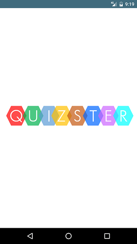
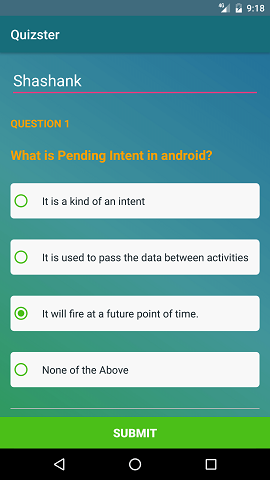
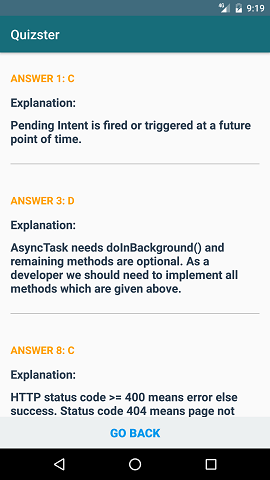

## Final Project for Android: User Inputs in Udacity Android Nanodegree

## Project Description

### This project design an Android Quiz app which lists some Multiple Choice Questions and depending on User's input , it shows the Final Score and the Explanation of the quesitons shown.

## Screenshot

    